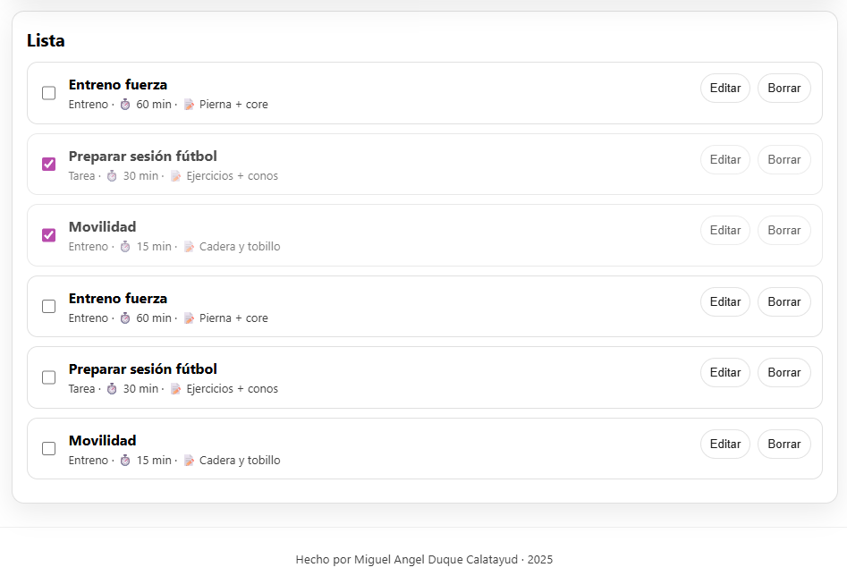

# Mini app: Tareas / Entrenos

Mini CRUD en JavaScript con LocalStorage: crear, editar, borrar, marcar completado, filtros, búsqueda, ordenación y exportación/importación JSON.

## Demo
https://miguelangelduque.github.io/mini-entrenos/

## Funcionalidades
- Crear / editar / borrar elementos
- Marcar como completado
- Filtros (tipo / estado), búsqueda y orden
- Persistencia con LocalStorage
- Exportar JSON e importar JSON

## Ejecutar en local
Abrir `index.html` en el navegador.

